# LLM Agent 框架可视化架构图

## 项目价值演进路径

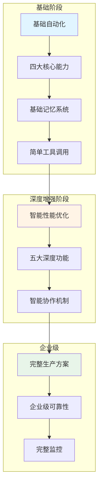

## 分层系统架构

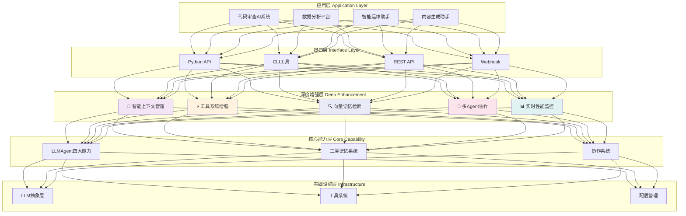

## 智能上下文管理系统

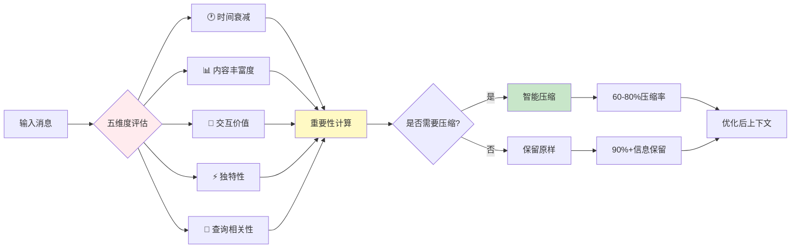

## 工具系统执行策略

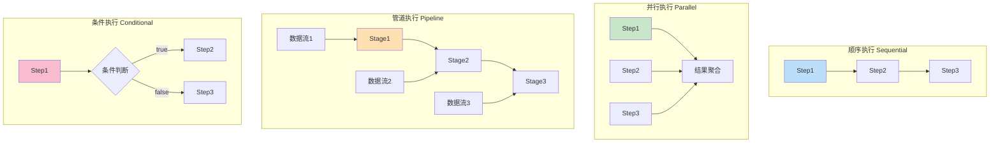

## 向量记忆检索系统

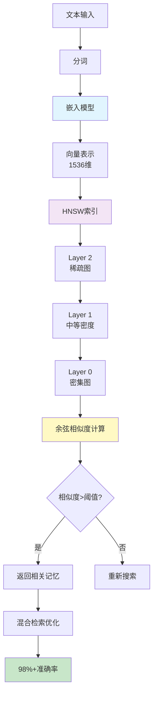

## 多Agent协作架构

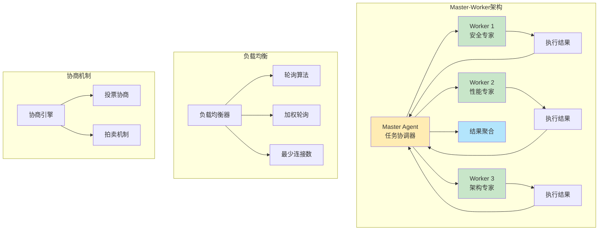

## 性能监控与优化系统

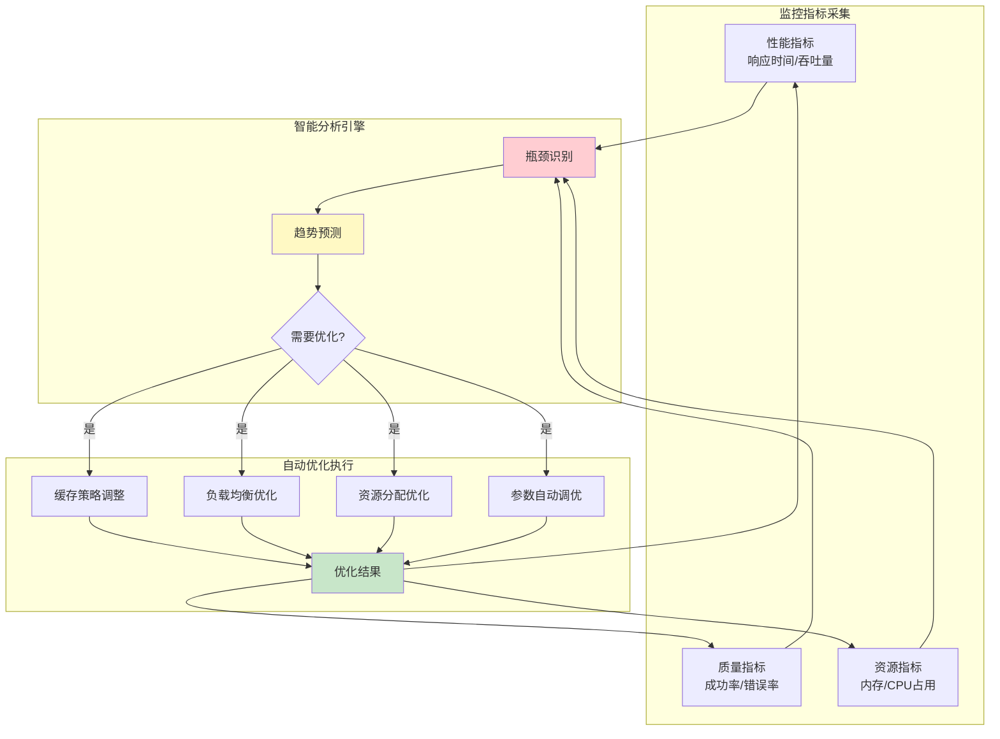

## 性能对比雷达图

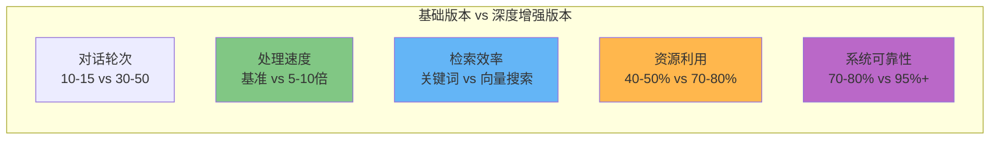

## 项目核心竞争力

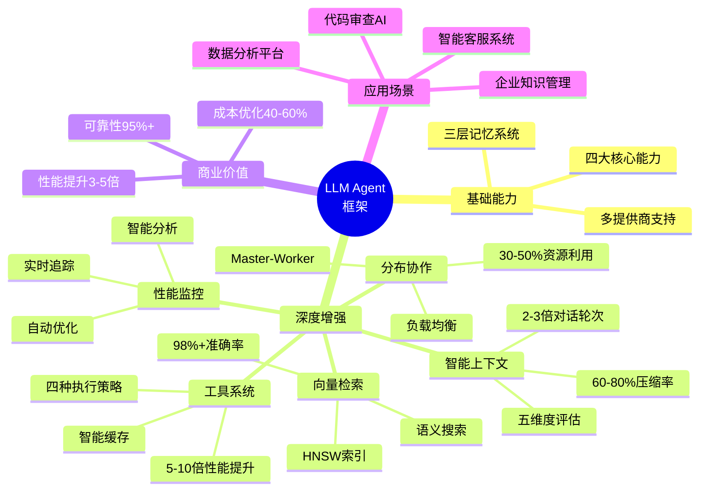

## 数据流处理管道

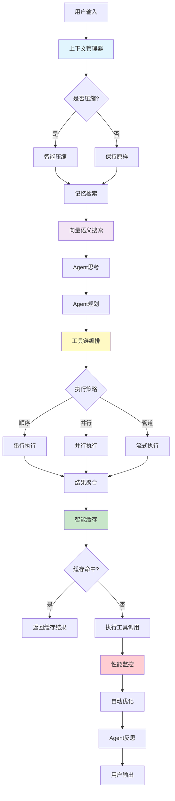

## 完整技术栈生态

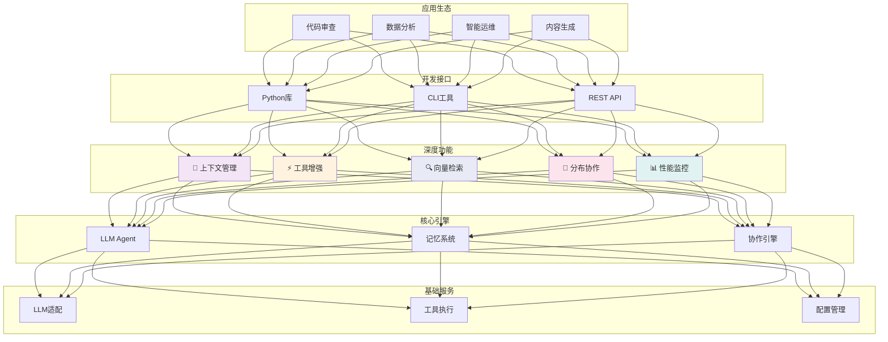

这些Mermaid图表可以在支持Mermaid的Markdown查看器中显示为可视化图表，包括GitHub、GitLab、VS Code等平台。